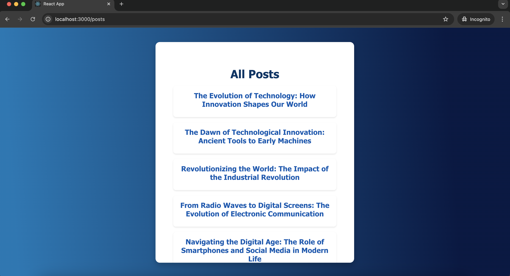

# Blog Website

Welcome to Blog Website! This application allows users to read, create, and delete blog posts. Built using React, this project demonstrates modern web development practices and offers a clean user interface.

## Features

- **View Posts:** Browse a list of all blog posts.
- **Read Single Post:** View the full content of individual blog posts.
- **Add New Post:** Create and publish new blog posts.
- **Delete Post:** Remove posts with a confirmation prompt.
- **Error Handling:** Displays error messages if actions fail.

## Technologies Used

- **React:** For building the user interface.
- **React Router:** For routing and navigation.
- **Axios:** For making HTTP requests.
- **CSS:** For styling the components.
## Screenshots

### Home Page


### Blog Post View




[Single Post View](assets/single_blog.png)

### Add Post


## Installation

1. **Clone the repository:**

   ```bash
   git clone https://github.com/Sherinr11/Blog-Website-using-React
2. **Navigate to the project directory:**
   ```bash
   cd react-blog
3. **Install dependencies:**
   ```bash
   npm install
4.**Start the development server:**
```bash
npm start
npm run start:server


